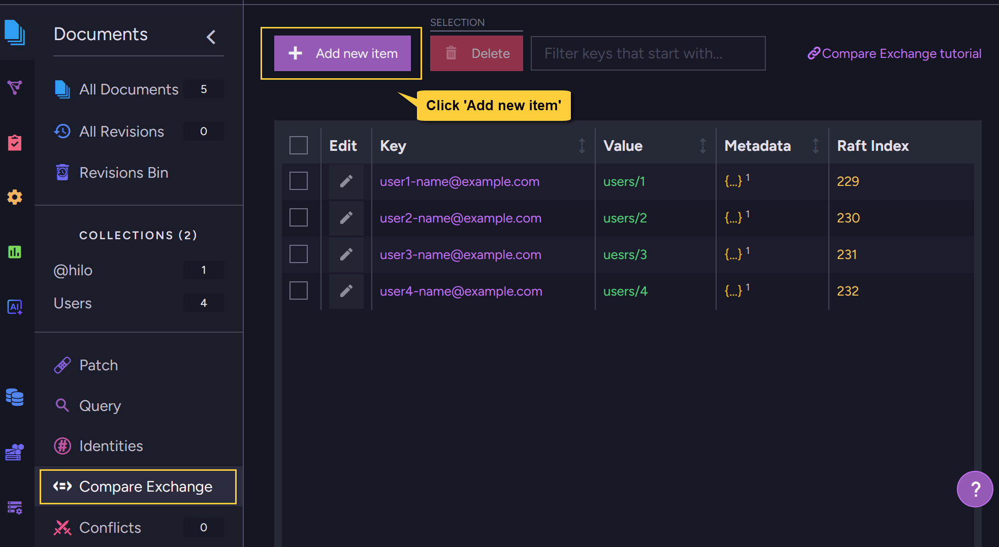
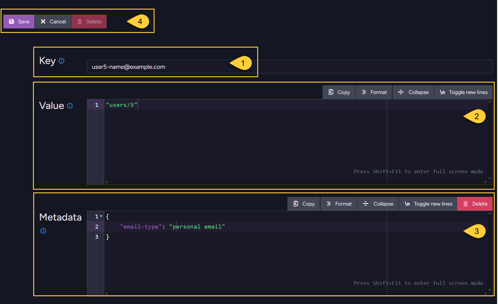

import Admonition from '@theme/Admonition';
import Tabs from '@theme/Tabs';
import TabItem from '@theme/TabItem';
import CodeBlock from '@theme/CodeBlock';

<Admonition type="note" title="">

* A new compare-exchange item can be created in the following ways:  
  * Via a cluster-wide session
  * Via a store operation  
  * Via the Studio  
 
* To modify an existing compare-exchange item, see: [Update compare-exchange items](../todo..).

* In this article:  
  * [Create items via a **Cluster-Wide session**](../compare-exchange/create-cmpxchg-items#create-items-via-a-cluster-wide-session)
  * [Create items via the **Studio**](../compare-exchange/create-cmpxchg-items#create-items-via-the-studio)
  * [Syntax](../compare-exchange/create-cmpxchg-items#syntax)     

</Admonition>

---

## Create items via a Cluster-Wide session

* Compare-exchange items can be created using a cluster-wide session.  
  Learn more about cluster-wide sessions in [Cluster transactions - overview](../client-api/session/cluster-transaction/overview).  

* Use `createCompareExchangeValue()` to add a new compare-exchange item to the session.  
  It will be created as part of the `saveChanges()` transaction.   
  
* An `InvalidOperationException` is thrown if the session is Not opened in cluster-wide mode.    
  If the key already exists, _saveChanges()_ will throw a `ConcurrencyException`.

#### Example

<TabItem value="" label="">
```php
// The session must be first opened with cluster-wide mode
$session->advanced()->clusterTransaction()->createCompareExchangeValue(
  key: "Best NoSQL Transactional Database",
  value: "RavenDB"
);

$session->saveChanges();
```
</TabItem>

---

## Create items via the Studio

To create compare-exchange items via the Studio, go to **Documents > Compare Exchange**.





1. **Key**  
   Enter a unique identifier for the compare-exchange item (up to 512 bytes).  
   This key must be unique across the entire database.
2. **Value**  
    Enter the value to associate with the key.  
    Can be a number, string, array, or any valid JSON object.
3. **Metadata** (optional)  
    Add any additional data you want to store with the item.  
    Must be a valid JSON object.  
    Can be used to [set expiration time](../todo..) for the compare-exchange item.  
4. **Save**  
   Click to create the compare-exchange item.  
   If the key already exists, an error message will be shown.

---

## Syntax

---

### `createCompareExchangeValue`  
Create compare-exchange item via cluster-wide session:

<TabItem value="" label="">
```php
$session->advanced()->clusterTransaction()->createCompareExchangeValue($key, $value);
```
</TabItem>

| Parameter  | Type     | Description                                                        |
|------------|----------|--------------------------------------------------------------------|
| **key**    | `string` | The compare-exchange item key. This string can be up to 512 bytes. |
| **value**  | `T`      | The associated value to store for the key.<br/>Can be a number, string, array, or any valid JSON object. |

| `create_compare_exchange_value` returns: | Description                                                                                           |
|---------------------------|----------------------------------------------------------------------------------------------------------------------|
| `CompareExchangeValue[T]` | The compare-exchange item that is added to the transaction.<br/>It will be created when `save_changes()` is called.  |

The `CompareExchangeValue`:

| Property   | Type     | Description                                                        |
|------------|----------|--------------------------------------------------------------------|
| **key**    | `string` | The compare-exchange item key. This string can be up to 512 bytes. |
| **value**  | `T`      | The value associated with the key.                                 |
| **index**  | `int`    | The index used for concurrency control.<br/>Will be `0` when calling `createCompareExchangeValue`. |   
