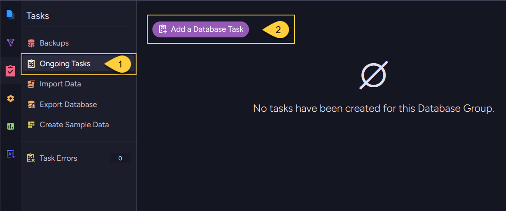
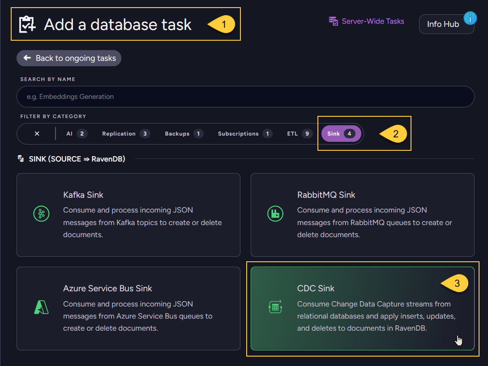
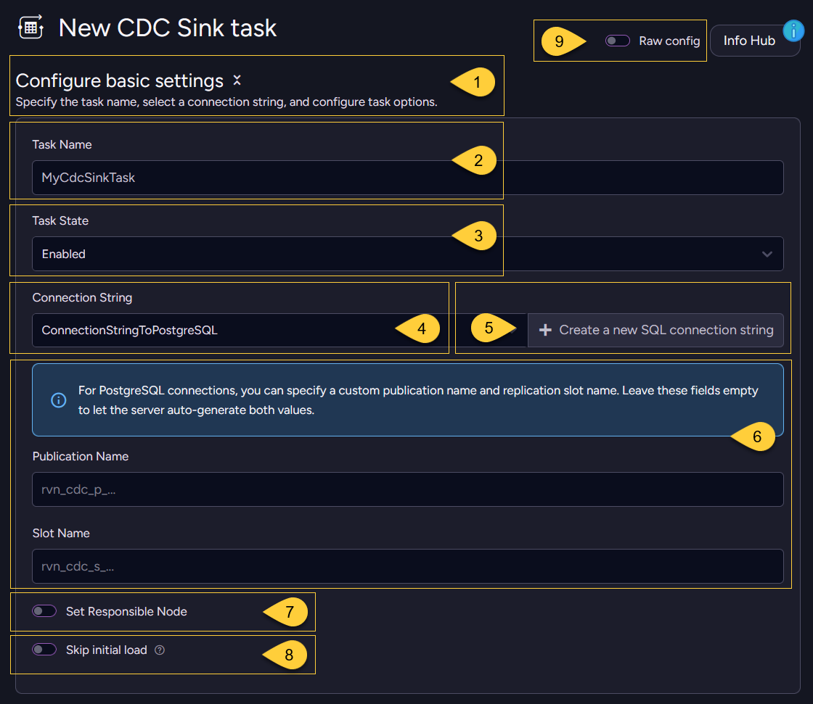
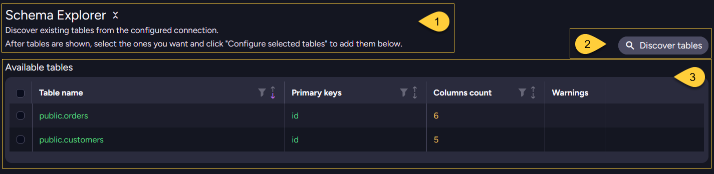
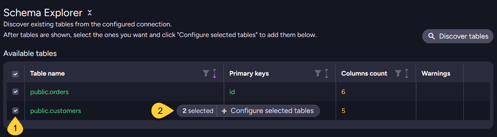
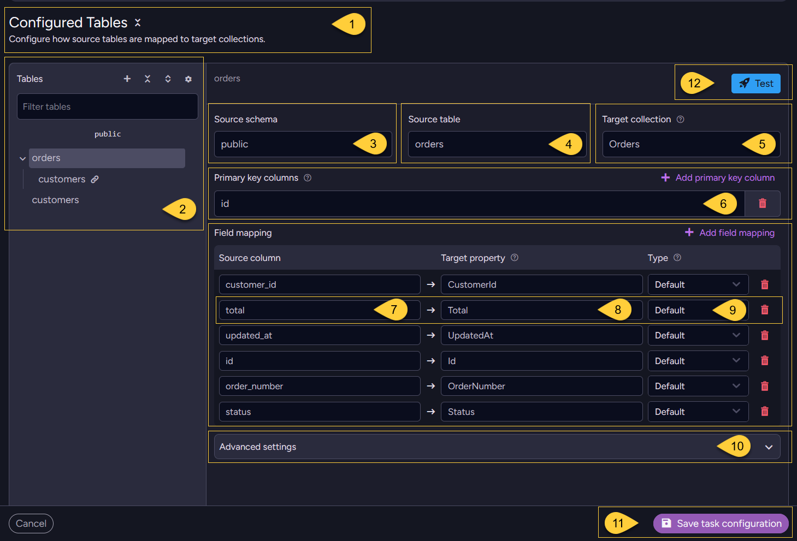

import Admonition from '@theme/Admonition';
import Tabs from '@theme/Tabs';
import TabItem from '@theme/TabItem';
import Panel from '@site/src/components/Panel';
import ContentFrame from "@site/src/components/ContentFrame";

<Admonition type="note" title="">

* A CDC Sink task consumes Change Data Capture streams from a relational source database  
  (PostgreSQL, SQL Server, or MySQL/MariaDB) and applies inserts, updates, and deletes to documents in RavenDB.    

* This article shows how to **create** a CDC Sink task using the Client API, Studio, or REST API.

* In this article:
  * [Create CDC Sink via Client API](#create-cdc-sink-via-client-api)
  * [Create CDC Sink via Studio](#create-cdc-sink-via-studio)
    * [Create task](..todo)
    * [Configure basic settings](..todo)
    * [Schema explorer](..todo)
    * [Configured tables](..todo)
    * [Advanced settings]()
    * [Test mapping]()
  * [Create CDC Sink via REST API](#create-cdc-sink-via-rest-api)

</Admonition>

<Panel heading="Create CDC Sink via Client API">

Use `AddCdcSinkOperation` to create a new CDC Sink task from a `CdcSinkConfiguration`.

The configuration references a registered SQL connection string by name.
CDC Sink uses the same `SqlConnectionString` type as [SQL ETL](../../../../../server/ongoing-tasks/etl/sql.mdx); 
the connection string's `FactoryName` determines the source engine.

Optionally set `SkipInitialLoad = true` only when the target RavenDB database already contains the initial data and the task should start from new CDC changes.

See [Configuration Syntax](../../../../../server/ongoing-tasks/cdc-sink/manage-cdc-sink-tasks/configuration-syntax.mdx)
for the full list of configuration classes and properties.    

<Tabs>
<TabItem value="sync" label="Sync">
```csharp
var config = new CdcSinkConfiguration
{  
    // Unique name for the CDC Sink task
    Name = "OrdersSync",   

    // Name of an existing SqlConnectionString, 
    // its FactoryName selects the source database engine
    ConnectionStringName = "MyPostgresConnection",
    
    // Optional: set to true only if RavenDB already contains the initial data.
    // SkipInitialLoad = true,
    
    Tables = new List<CdcSinkTableConfig>
    {
        new CdcSinkTableConfig
        {
            // Map the source table to the Orders collection in RavenDB    
            CollectionName = "Orders", 
            SourceTableName = "orders",   

            // Primary key columns are used to generate document IDs
            // and must be included in Columns    
            PrimaryKeyColumns = new List<string> { "id" },
    
            // Map source columns to RavenDB document properties.
            Columns =
            [
                new CdcColumnMapping() { Column = "id",            Name = "Id" },
                new CdcColumnMapping() { Column = "customer_name", Name = "CustomerName" },
                new CdcColumnMapping() { Column = "total",         Name = "Total" },
            ]
        }
    }
};

// Execute the operation by passing it to Maintenance.Send    
var result = store.Maintenance.Send(new AddCdcSinkOperation(config));

long taskId = result.TaskId;
```
</TabItem>
<TabItem value="async" label="Async">
```csharp
var config = new CdcSinkConfiguration
{  
    // Unique name for the CDC Sink task
    Name = "OrdersSync",   

    // Name of an existing SqlConnectionString, 
    // its FactoryName selects the source database engine
    ConnectionStringName = "MyPostgresConnection",
    
    // Optional: set to true only if RavenDB already contains the initial data.
    // SkipInitialLoad = true,
    
    Tables = new List<CdcSinkTableConfig>
    {
        new CdcSinkTableConfig
        {
            // Map the source table to the Orders collection in RavenDB    
            CollectionName = "Orders", 
            SourceTableName = "orders",   

            // Primary key columns are used to generate document IDs 
            // and must be included in Columns    
            PrimaryKeyColumns = new List<string> { "id" },
    
            // Map source columns to RavenDB document properties.
            Columns =
            [
                new CdcColumnMapping() { Column = "id",            Name = "Id" },
                new CdcColumnMapping() { Column = "customer_name", Name = "CustomerName" },
                new CdcColumnMapping() { Column = "total",         Name = "Total" },
            ]
        }
    }
};

// Execute the operation by passing it to Maintenance.SendAsync    
var result = await store.Maintenance.SendAsync(new AddCdcSinkOperation(config));

long taskId = result.TaskId;
```
</TabItem>
</Tabs>

`AddCdcSinkOperationResult`:

| Property           | Type   | Description |
|--------------------|--------|-------------|
| `TaskId`           | `long` | Assigned task ID |
| `RaftCommandIndex` | `long` | Raft index of the command |

</Panel>

<Panel heading="Create CDC Sink via Studio">

#### Create task
    
    

1. Navigate to **Databases** → your database → **Tasks** → **Ongoing Tasks**.
2. Click **Add a Database Task** 
    
---
    
        
    
1. todo
2. todo
3. todo    

---
    
#### Configure basic settings       
    
   
    
1. todo
2. todo
3. todo  
4. todo
5. todo
6. todo  
7. todo
8. todo
9. todo      

---
    
#### Schema explorer
    
     

1. todo
2. todo
3. todo     
    
     

1. todo
2. todo
    
---
    
#### Configured tables
    
      
    
1. todo
2. todo
3. todo  
4. todo
5. todo
6. todo  
7. todo
8. todo
9. todo    
10. todo
11. todo       
12. todo       
    
---
    
#### Test mapping
    
---    
    
#### Advanced settings
   
---    

<Admonition type="note" title="">
    
Toggle **Raw config** at the top of the form to view or paste the task's JSON configuration
directly - useful for copying a configuration between environments.
    
</Admonition>

</Panel>

<Panel heading="Create CDC Sink via REST API">
    
<ContentFrame>
    
### Discover the source database schema  
    
Use this endpoint to list tables, columns, primary keys, and foreign keys from the source database.  
Use the returned schema metadata to build the `Tables` section of the `CdcSinkConfiguration` before sending the create-task request.    
    
The request body should include either:
* `ConnectionStringName`, to use a saved SQL connection string, or  
* `Connection`, to pass an inline `SqlConnectionString`. 
    
For PostgreSQL, you can include `Schemas` to limit schema discovery (defaults to `["public"]`).      

| Method | Endpoint | Auth |
|--------|----------|------|
| `POST` | `/databases/{databaseName}/admin/cdc-sink/schema` | `DatabaseAdmin` |

</ContentFrame>
<ContentFrame>
    
### Create the task
    
Send a `PUT` request whose body is the JSON `CdcSinkConfiguration`.  
Omit the `id` query-string parameter to create a new task; the response returns the assigned `TaskId`.

| Method | Endpoint | Auth |
|--------|----------|------|
| `PUT`  | `/databases/{databaseName}/admin/cdc-sink` | `DatabaseAdmin` |

</ContentFrame>    
    
</Panel>
